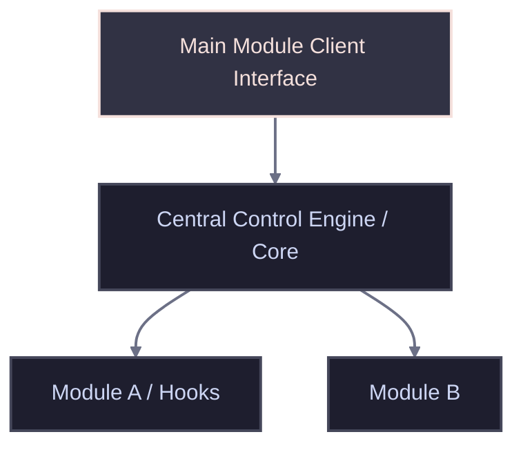

<!-- TEMPLATE: MANUAL.template.md -->
<!--
MANUAL
Any text bounded by double curly braces {{like this}} is a placeholder for you to fill out.
Replace those placeholders with real paths, rules, and project constraints.

INSTRUCTIONS FOR THE AI AGENT:
This file is the developer's handbook. It maps structural topologies, data flow,
core algorithms, algebraic formulas, configuration guidelines, and technical specifications.
-->

<!-- markdownlint-disable MD013 -->

# MANUAL

## 📑 AI Primary Files

- 🔹 [AGENTS.md](../AGENTS.md)
- 🔹 [ARCHIVE.md](ARCHIVE.md)
- 🔹 [BUILD.md](BUILD.md)
- 🔹 [CODE.md](CODE.md)
- 🔹 [DESIGN.md](DESIGN.md)
- 🔹 [FEATURES.md](FEATURES.md)
- 🔹 [LOG.md](LOG.md)
- 🔸 [MANUAL.md](MANUAL.md)
- 🔹 [README.md](../README.md)
- 🔹 [SPEC.md](SPEC.md)
- 🔹 [TASKS.md](TASKS.md)
- 🔹 [TERMS.md](TERMS.md)
- 🔹 [TESTING.md](TESTING.md)
- 🔹 [VERSIONS.md](VERSIONS.md)

---

<!-- TOC location -->
## 🔍 Table of Contents
<!-- Maintained by script -->

---

## 📥 Installation & Initial Deployment

### Setup Sequence

- 1. **Compile/Build Assets:** Run the compile script or build pipeline as documented in [BUILD.md](BUILD.md).
- 1. **Apply Configurations:** Run administrative scripts or system configurations required for the base application environment.
- 1. **Register Components:** Execute target registry configurations or system file bindings to link the software with the host operating system.

---

## 🏗️ 1. Architecture Overview
<!--
Outline the structural relationship of files and modules.
Include raw ASCII boxes or diagrams to make the architecture immediately obvious.
Detail the high-level operational lifecycle, stating what initiates, handles, and registers events
-->

---

## 🧠 2. Core Modules & Systems
<!--
Document individual subsystems, class constructors, interfaces,   and persistent background loops that govern state transitions.
List of Core Modules
-->
<!-- template: core module
- **{{name}}**: {{Describe internal class interfaces, global trackers, state variables, and callbacks}}
-->

---

## 🔎 3. Core Algorithm & Mathematical Formulas
<!--
Specify any underlying physical or software math calculations used.
Represent equations cleanly in LaTeX format (e.g. $$ formula $$) with detailed variable legends.
Describe the logical steps, logic gates, conditional switches, or core algorithm steps}}
List of formulas
-->
<!-- template: formula
- **`{{name}}`**: {{description}}
-->

---

## 🛰️ 4. Commands, Keybindings & Context Flags
<!--
Detail the operational command registry. This lists all binding combinations,  modifier mappings, context filters, and background triggering gates.
List of actions
-->
<!-- tamplate: action
- **{{name}}**:
  - **{{subitem}}**: {{desc}}
  - **{{subitem}}**: {{desc}}
  - **{{subitem}}**: {{desc}}
-->

---

## 🔧 5. Workspace Build & Configuration
<!--
Document configuration files format (.ini, .json, .env.example) and properties mapping. Highlight how to customize settings.
List of configs
-->
<!-- template: config
- **{{name}}:** {{value}}
  - **Purpose:** {{purpose}}
  - **Format:** {{format}}
  - **Details:** {{details}}
-->

---

## 🔍 Diagnostics & Common Troubleshooting

### Known Failure States & Remediations
<!--
List of Symptoms
-->
<!-- template: symptom
#### 🚨 Symptom: "{{description}}"
- **Root Cause:** {{root cause}}
- **Remediation:** {{remediation}}
-->

---

## 🚀 Go to...

- 🔹 [AGENTS.md](../AGENTS.md)
- 🔹 [ARCHIVE.md](ARCHIVE.md)
- 🔹 [BUILD.md](BUILD.md)
- 🔹 [CODE.md](CODE.md)
- 🔹 [DESIGN.md](DESIGN.md)
- 🔹 [FEATURES.md](FEATURES.md)
- 🔹 [LOG.md](LOG.md)
- 🔸 [MANUAL.md](MANUAL.md)
- 🔹 [README.md](../README.md)
- 🔹 [SPEC.md](SPEC.md)
- 🔹 [TASKS.md](TASKS.md)
- 🔹 [TERMS.md](TERMS.md)
- 🔹 [TESTING.md](TESTING.md)
- 🔹 [VERSIONS.md](VERSIONS.md)

<!-- TEMPLATE: MANUAL.template.md -->
